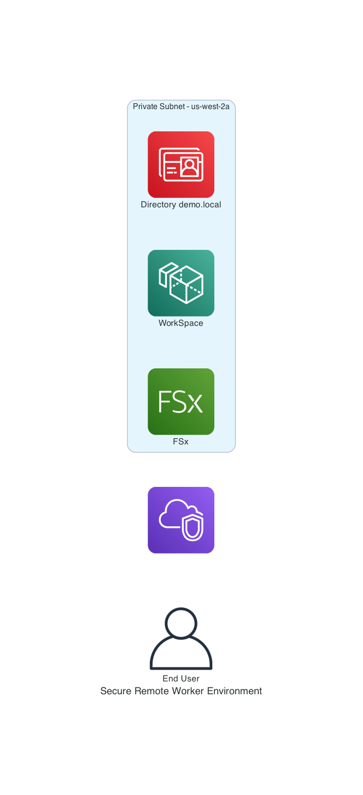

# Secure Remote Worker Environment
Inspired by AWS's [Secure Remote Worker Environment Reference Architecture](https://d1.awsstatic.com/architecture-diagrams/ArchitectureDiagrams/secure-remote-worker-environment-ra.pdf?did=wp_card&trk=wp_card), deployed using Infrastructure as Code (IaC)


## Table of Contents
- [Technologies](#technologies)
- [Usage](#usage)
    - [Pre-requisites](#pre-requisites)
    - [Deployment](#deployment)
- [Future Work](#future-work)
- [References](#references)


## Technologies
- Terrafrom
- Ansible (in the future)
- more





As for now, the following resources are provisioned by Ansible:
- AWS Managed Microsoft AD
- AWS WorkSpace
- FSx File Server


# Usage

## Pre-requisites

- AWS Account
- Terraform 


These instructions will get you a copy of the project up and running on your local machine for development and testing purposes. See deployment for notes on how to deploy the project on a live system.


## Deployment
- Just clone this repository by typing: git clone `https://github.com/eric5rivera/secure-remote-worker-environment.git`
- Switch to project directory: `secure-remote-worker-environment.git`
- Create a Terraform Cloud Workspace 

```bash
terraform init
```

## Future Work
- Implement multi-factor authentication (MFA)
- Implement Group policy in Active Directory to prevent unwanted activities
- Forward DNS to Amazon Route 53 VPC DNS resolver with applied Route 53 Resolver DNS Firewall
rules
- Stand up AWS Network Firewall, NAT gateway and internet gateway
- Configure firewall rules to block outbound
traffic to unwanted sites 


## References
https://docs.aws.amazon.com/directoryservice/latest/admin-guide/microsoftadbasestep3.html


https://blog.knoldus.com/how-to-deploy-aws-workspaces-in-aws-using-terraform/

https://medium.com/analytics-vidhya/terraform-diagrams-provisioning-and-visualizing-a-simple-environment-on-aws-471f5d88c95d