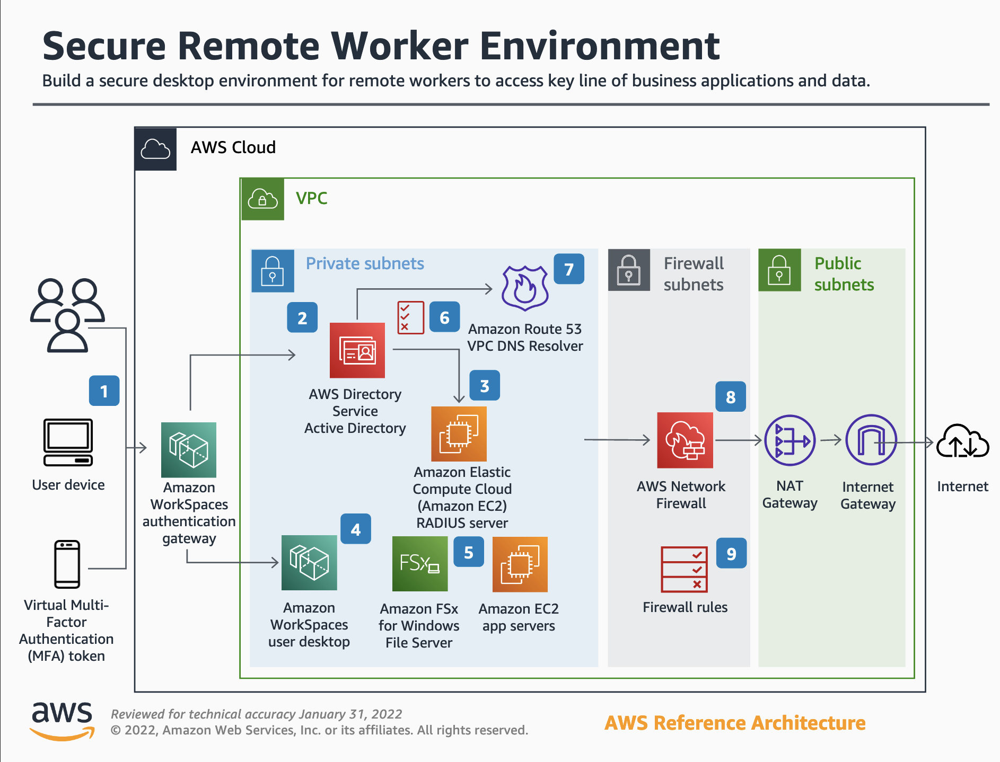

# Secure Remote Worker Environment
This is an implimentation of AWS's [Secure Remote Worker Environment Reference Architecture](https://d1.awsstatic.com/architecture-diagrams/ArchitectureDiagrams/secure-remote-worker-environment-ra.pdf?did=wp_card&trk=wp_card) using automation tools such as Terrafrom and Ansible (in the future).

## Installation
https://blog.knoldus.com/how-to-deploy-aws-workspaces-in-aws-using-terraform/

## Usage
https://medium.com/analytics-vidhya/terraform-diagrams-provisioning-and-visualizing-a-simple-environment-on-aws-471f5d88c95d

## Install AD Users and Computers
https://docs.aws.amazon.com/directoryservice/latest/admin-guide/microsoftadbasestep3.html